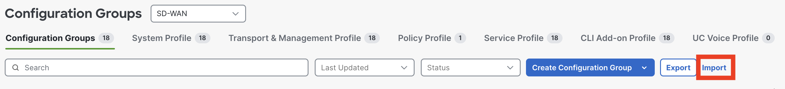

# Cisco-IIoT-SD-WAN-Catalogs

<!DOCTYPE html>
<html>

 Cisco SD-WAN Catalogs are essentially edge device configuration groups that can be imported directly into Catalyst SD-WAN. Further, Cisco Industrial IoT devices can be added to the group and the configuration deployed with few clicks, reducing the need to build such configuration groups from scratch. 

  

 All catalogs are Cisco Validated Profiles (CVP) and their names start with CVP and some other designation. In all profiles (N) in the name refers to a deployment in NAT mode (aka Direct Internet Access or DIA) where LAN traffic is sent directly to the internet, while (R) in the name refers to a routed deployment where all LAN traffic will be routed to a central hub advertising a default route. 

 The table below lists all IIoT SD-WAN catalogs which have been tested and validated by Cisco for use with Cisco Industrial IoT Platforms (IR1101, IR1800, IR8340). Each published catalog is essentially a tar file that can be imported directly into the matching Catalyst SD-WAN release as a Configuration Group. That group can then be modified further, if needed, prior to attaching and deploying on edge devices.  Catalogs come with certain global values pre-configured to ease deployment, such as interface names, cellular timers optimizations to reduce cellular data usage, pre-defined service VPNs and other services such as NTP, DNS, DHCP, and Logging. Each catalog also comes with a PDF file that explains in more detail the functionality of the catalog. Below is example where to import the Catalog tar file in Cisco SD-WAN 

<head>
  Catalog Entries By Release
</head>
<body>
<table>
  <thead>
    <tr>
      <th></th>
      <th width="16%">Cisco Validated Profile (CVP)</th>
      <th width="18%">Cisco IIoT Platforms</th>
      <th width="20%">Catalyst SD-WAN Release</th>
      <th width="10%">Applications Profiles</th>
      <th>Functional Description</th>
    </tr>
  </thead>
  <tbody>
    <tr>
      <td>1</td>
      <td><a href="./IR1101/CVP1N">CVP1N</a> <a href="./IR1101/CVP1R">CVP1R</a></td>
      <td>IR1101</td>
      <td>20.15.2+</td>
      <td>NA</td>
      <td>Single router SD-WAN configurations with wired and single LTE as last resort supporting single service VPN for for horizontal IR1101 deployments.</td>
    </tr>
    <tr>
      <td>2</td>
      <td><a href="./IR18xx/CVP2N">CVP2N</a> <a href="./IR18xx/CVP2R">CVP2R</a></td>
      <td>IR1800</td>
      <td>20.15.2+</td>
      <td>NA</td>
      <td>Single router SD-WAN configurations with wired and single LTE as last resort supporting single service VPN for for horizontal IR1800 deployments.</td>
    </tr>
    <tr>
      <td>3</td>
      <td><a href="./IR1101/CVP1NX">CVP1NX</a> <a href="./IR18xx/CVP2NX">CVP2NX</a></td>          
      <td>IR1101 & IR1800</td>
      <td>20.15.2+</td>
      <td>NA</td>
      <td>Single router SD-WAN configurations with LTE and wired as last resort supporting single service VPN for for horizontal IR deployments. Reverse priority of CVP1N and CVP2N</td>
    </tr>   
    <tr>
      <td>4</td>
      <td><a href="./Roadways/CVP5">CVP5</a> <a href="./Roadways/CVP6">CVP6</a></td>
      <td>IR1101 & IR1835 Roadways</td>
      <td>20.15.2+</td>
      <td>NA</td>
      <td>Single router SD-WAN configurations with wired and single LTE as last resort supporting multiple service VPN for Roadways deployments with ISE integration and lan port authentication</td>
    </tr>
    <tr>
      <td>5</td>
      <td><a href="./IR1101/CVP3NAA">CVP3NAA</a> <a href="./IR1101/CVP3NAS">CVP3NAS</a></td>      
      <td>IR1101 Dual LTE 
active/active &amp; 
 active/standby</td>
      <td>20.15.2+  
          &amp; IOS 17.18.1/17.15.4
      </td>
      <td>NA</td>
      <td>Single router SD-WAN configurations with wired and dual LTE in both active/active and active/standby modes, supporting single service VPN for for horizontal IR deployments.</td>
    </tr>
    <tr>
      <td>6</td>
      <td><a href="./IR18xx/CVP4NAA">CVP4NAA</a> <a href="./IR18xx/CVP4NAS">CVP4NAS</a></td>      
      <td>IR1800 Dual LTE 
 active/active &amp; 
  active/standby</td>
      <td>20.15.2+  
          &amp; IOS 17.18.1/17.15.4
      </td>
      <td>NA</td>
      <td>Single router SD-WAN configurations with wired and dual LTE in both active/active and active/standby modes, supporting single service VPN for for horizontal IR deployments.</td>
    </tr>    
    <tr>
      <td>7</td>
      <td><a href="./IR1101/CVP_apps/CVP1N_SEA">CVP1N_SEA</a> <a href="./IR18xx/CVP_apps/CVP2N_SEA">CVP2N_SEA</a></td>
      <td>IR1101 & IR1800</td>
      <td>20.18.1+</td>
      <td>SEA</td>
      <td>Same as CVP1N/CVP2N with Cisco Secure Equipment Access agent deployment included.</td>
    </tr>
    <tr>
      <td>8</td>
      <td><a href="./IR1101/CVP_apps/CVP1N_TE">CVP1N_TE</a> <a href="./IR18xx/CVP_apps/CVP2N_TE">CVP2N_TE</a></td>
      <td>IR1101 & IR1800</td>
      <td>20.18.2+</td>
      <td>ThousandEyes</td>
      <td>Same as CVP1N/CVP2N with ThousandEyes agent deployment included.</td>
    </tr>
    <tr>
      <td>9</td>
      <td><a href="./IR1101/CVP_apps/CVP1N_TESEA">CVP1N_TESEA</a> <a href="./IR18xx/CVP_apps/CVP2N_TESEA">CVP2N_TESEA</a></td>
      <td>IR1101 & IR1800</td>
      <td>20.18.2+</td>
      <td>ThousandEyes & SEA</td>
      <td>Same as CVP1N/CVP2N with ThousandEyes and Secure Equipment agents deployment included.</td>
    </tr>
    <tr>
      <td>10</td>
      <td>CVP5_CV CVP6_CV</td>
      <td>IR1101 & IR1835 Roadways (CV)</td>
      <td>Coming Soon</td>
      <td>Cyber Vision</td>
      <td>Single router SD-WAN configurations with wired and single LTE as last resort supporting multiple service VPN for Roadways deployments with ISE integration and lan port authentication. Also includes profile to deploy Cyber Vision sensor in IOX</td>
    </tr>
    <tr>
      <td>11</td>
      <td>CVP6_CVSEA CVP6_CVTE</td>
      <td width="18%">IR1835 
 Roadways (CV&SEA)
 Roadways (CV&TE)</td>
      <td>Coming Soon</td>
      <td>Cyber Vision & SEA</td>
      <td>IR1835 Roadways catalog with combined applications, Cyber Vision & Secure Equipment Access or Cyber Vision & ThousandEyes.</td>
    </tr>
    <tr>
      <td>12</td>
      <td>CVP7R</td>
      <td>IR8340</td>
      <td>Coming Soon</td>
      <td>NA</td>
      <td></td>
    </tr>
    <tr>
      <td>13</td>
      <td><a href="./IR18xx/CVP_UTD">CVP_UTD</a></td>
      <td>IR1835</td>
      <td>20.18.2+</td>
      <td>UTD</td>
      <td>IR1835 Roadways Sample Policy Group export that enables installation of UTD and creates sample NGFW activating UTD features.</td>
    </tr>
  </tbody>
</table>
</body>
</html>

 Cisco provides the configurations in this catalogs as is for your convenience. These configurations have been built using industry best practices, observed across multiple deployments, which may be beneficial to you. Cisco is not responsible for any technical issues, bugs, or other issues that may arise from your use of these configurations and any resulting indirect, incidental, reliance, consequential, special or exemplary damages or loss of actual or anticipated revenue, profit, business, savings, data goodwill or use, business interruption, damaged data, wasted expenditure or delay in delivery (in all cases, whether direct or indirect). 

