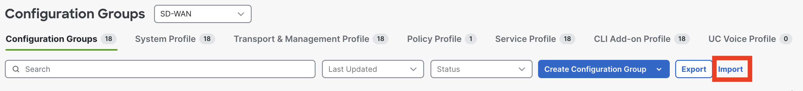

# Cisco-IIoT-SD-WAN-Catalogs

<!DOCTYPE html>
<html>

 Cisco SD-WAN Catalogs are essentially edge device configuration groups that can be imported directly into Catalyst SD-WAN. Further, Cisco Industrial IoT devices can be added to the group and the configuration deployed with few clicks, reducing the need to build such configuration groups from scratch. 

  

 All catalogs are Cisco Validated Profiles (CVP) with CVP in the name along with some other designation. In all profiles (N) in the name refers to a deployment in NAT mode (aka Direct Internet Access or DIA) where LAN traffic is sent directly to the internet and no HUB is present, while (R) in the name refers to a routed deployment where all LAN traffic will be routed to a central hub advertising a default route. When using any catalog with NAT (DIA), a configuration topology should be deployed to deny all route exchanges with vSmart controllers to avoid edge2edge tunnels. To do this, tag all WAN edges with a common tag and then apply the tag to a rule for inbound/outbound sites in the creation of a custom topology in "Configurations --> Topology" and activate it, thereby stopping all tunnel formations. <a href="./metadata/deny-all-topology-for-dia.png">Sample deny-all Configuration Topology</a> 

 All catalogs control egress interface for traffic generated inside service VPNs using ipsec preference field in the tunnel configuration of the transport. When doing Active/Active, the ipsec preference is the same for both tunnels to toad balance traffic. All traffic that is DIA will use the current active underlay WAN interface. In case of Active/Active both interfaces will be used for such traffic.

<table>
  <tr>
    <td>
      <h3>Need help choosing a catalog?</h3>
      
Use the interactive selector to select a router, preferred primary WAN, and traffic model to the closest published Cisco IIoT SD-WAN catalog.

      <h2><a href="https://jaykhalil.github.io/Cisco-IIoT-SD-WAN-Catalogs/catalog-selector.html">Open the Catalog Selector</a></h2>
    </td>
  </tr>
</table>

 A catalog is essentially a tar file that can be imported directly into the matching Catalyst SD-WAN release as a Configuration Group. That group can then be modified further, if needed, prior to attaching and deploying on edge devices. Catalogs come with certain global values pre-configured to ease deployment, such as interface names, cellular timers optimizations to reduce cellular data usage, pre-defined service VPNs and other services such as NTP, DNS, DHCP, and Logging. Each catalog also comes with a PDF file that explains in more detail the functionality of the catalog. Below is example where to import the Catalog tar file in Cisco SD-WAN 

For a complete list of all available catalogs: <a href="./CATALOGS.md"> SD-WAN Industrial Routers Catalogs</a>

</html>

 Cisco provides the configurations in this catalogs as is for your convenience. These configurations have been built using industry best practices, observed across multiple deployments, which may be beneficial to you. Cisco is not responsible for any technical issues, bugs, or other issues that may arise from your use of these configurations and any resulting indirect, incidental, reliance, consequential, special or exemplary damages or loss of actual or anticipated revenue, profit, business, savings, data goodwill or use, business interruption, damaged data, wasted expenditure or delay in delivery (in all cases, whether direct or indirect). 

